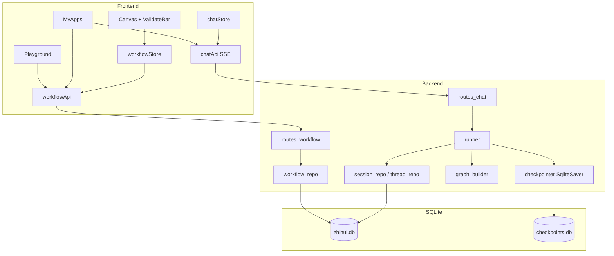
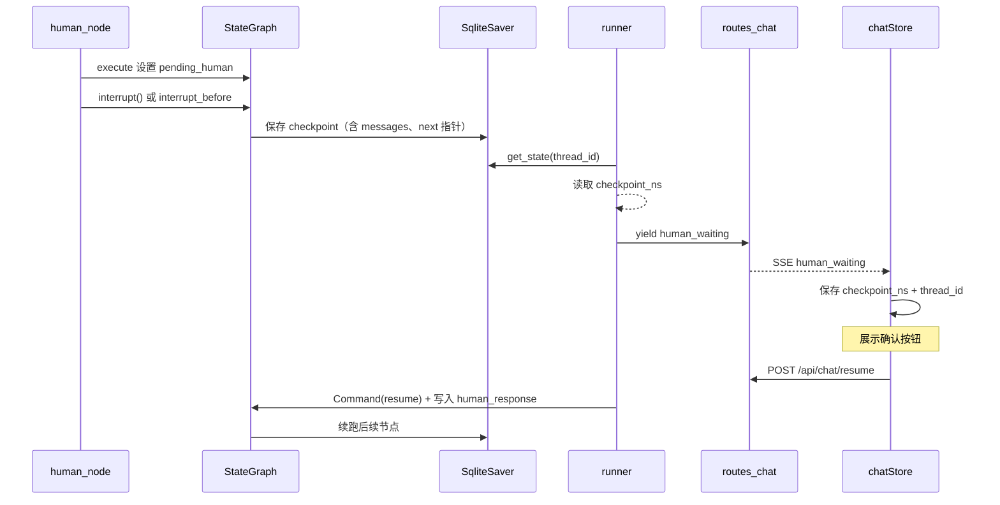

# IMPLEMENTATION_PLAN.md — 知汇平台 Demo 实施计划

> **这是一个 Demo，不是生产级项目。**
>
> **在编写任何代码之前，必须先确认本文档。** 确认后按「实施阶段」分步生成代码。
>
> 约束来源：`AGENT.md`（宪章）· `SKILL.md`（工程规范）· `PROTOCOL.md` v2.0（API / SSE）· `PROJECT_BRIEF.md`（业务）

---

## 决策说明

**需求理解**：为业务/咨询人员提供 Agent 低代码编排（Canvas + LangGraph）与应用对话（Playground / MyApps + SSE），支持 RAG/LLM、人工介入断点续跑、工作流版本只读发布。

**技术选择**：

- **SQLite** 存业务元数据（工作流版本、thread 会话）；**SqliteSaver** 存 LangGraph checkpoint（`checkpoints.db`），分离业务库与引擎库，便于 Demo 单机部署。
- **工作流版本表** `workflow_versions` 不可变行 + `workflows` 应用主表指向 `current_version`，满足 `AGENT.md` §3.4。
- 人工挂起：**LangGraph `interrupt` + State 字段 + `threads.checkpoint_ns`** 三处对齐，SSE 推送 `human_waiting`（`PROTOCOL.md` §3）。
- 前端单入口单出口：**ValidateBar + `validateCanvasGraph()`** 与后端 `graph_builder.validate_graph()` 规则一致，发布前双端校验。

**范围边界**：

| 本次计划覆盖 | 本次不做 |
|--------------|----------|
| State 设计、DDL、画布校验、6+1 API（`PROTOCOL.md`） | 登录 / 多租户 RBAC |
| Playground、MyApps、Canvas 三页 | GraphRAG 完整实现 |
| 节点：start、end、llm、rag、human、router（MVP） | K8s、消息队列 |
| SSE：execute + resume | 超过 10 个 REST 端点 |

---

## 一、业务与页面

| 页面 | 路由 | 职责 |
|------|------|------|
| Playground | `/playground` | 应用广场；`GET /api/workflows/playground`；卡片展示 **`current_version`** |
| MyApps | `/my-apps` | 个人应用；`GET /api/users/apps`；新建/继续对话入口 |
| Canvas | `/canvas/:workflowId?` | 编排画布；草稿保存 + 发布 |

**痛点**（`PROJECT_BRIEF.md`）：用知识库 + LLM 降低咨询门槛；工作流固化重复人工步骤；支持人工确认节点。

---

## 二、系统架构



---

## 三、LangGraph `State` 字段设计（重点）

定义文件：`backend/src/core/state.py`

### 3.1 `WorkflowState` 完整字段

```python
from typing import Annotated, Any, Literal, Optional
from typing_extensions import TypedDict
from langgraph.graph.message import add_messages
from langchain_core.messages import BaseMessage

SessionStatus = Literal["running", "waiting_human", "completed", "failed"]

class PendingHuman(TypedDict, total=False):
    node_id: str
    question: str

class WorkflowState(TypedDict):
    # --- 会话与版本上下文（runner 每次注入）---
    workflow_id: str
    workflow_version: str          # 如 v2.0.0，绑定不可变 workflow_versions 行
    thread_id: str                 # 与 PROTOCOL execute/resume 一致；Checkpointer thread

    # --- 对话与本轮输入 ---
    messages: Annotated[list[BaseMessage], add_messages]
    input_text: str                # execute: 用户消息；resume: 可为空

    # --- LangGraph checkpoint 命名空间（PROTOCOL human_waiting.checkpoint_ns）---
    checkpoint_ns: Optional[str]

    # --- 人工介入挂起态（核心）---
    session_status: SessionStatus
    pending_human: Optional[PendingHuman]   # 挂起时：待确认节点与文案
    human_response: Optional[str]         # resume 后：user_input.comment 等写入
    user_confirm: Optional[bool]          # resume：user_input.confirmed

    # --- 执行指针与节点产出 ---
    current_node_id: Optional[str]
    next_node_id: Optional[str]           # RouterNode 写入
    node_outputs: dict[str, Any]          # 按画布 node_id 索引

    # --- 领域数据 ---
    rag_context: Optional[str]
    final_output: Optional[str]           # done 事件 final_output 来源

    # --- 错误 ---
    error: Optional[str]
```

### 3.2 字段与人工挂起的关系

| 阶段 | `session_status` | 关键 State 字段 | 持久化位置 |
|------|------------------|-----------------|------------|
| 正常运行 | `running` | `messages` 追加、`node_outputs` 更新 | Checkpointer 自动快照 |
| 进入 `human` 节点 | → `waiting_human` | `pending_human={node_id, question}` | interrupt 前 checkpoint 写入 `checkpoints.db` |
| SSE 推送后 | `waiting_human` | `checkpoint_ns` 从 `get_state()` 读出写入 threads 表 | `threads.checkpoint_ns` |
| 用户确认 resume | → `running` | `human_response`、`user_confirm` 注入后 `update_state` | 新 checkpoint |
| 图执行完毕 | `completed` | `final_output` 填充 | `threads.status=completed` |
| 异常 | `failed` | `error` | `threads.status=failed` |

### 3.3 人工介入执行链（State + interrupt + SSE）



**实现约束**（`AGENT.md` §5.4）：

- `human_node.py`：`execute` 内设置 `pending_human`；使用当前 LangGraph 文档确认的 `interrupt` 写法；**不确定 API 时停止编码并提问**。
- `runner.stream_resume`：`user_input` → `human_response` / `user_confirm` → `graph.invoke` / `stream` 从 `checkpoint_ns` 续跑。
- **禁止**在 `api/routes_chat.py` 内直接 `update_state`。

### 3.4 与 `NODE_TYPE_MAP` / RouterNode 的协作

- 业务节点（`llm_node`、`rag_node`）**只写** `node_outputs`、`messages`、`rag_context`。
- **分支**仅 `router_node` 读 `node_outputs` 写 `next_node_id`。
- `graph_builder` 用 `add_conditional_edges` 时，路由函数读 `next_node_id`（行内注释仅允许在此处，见 `SKILL.md` §6）。

---

## 四、SQLite DDL（重点）

业务库：`backend/data/zhihui.db`  
检查点库：`backend/data/checkpoints.db`（LangGraph `SqliteSaver` 自建表，**不手写 DDL**）

### 4.1 ER 关系

```mermaid
erDiagram
    workflows ||--o{ workflow_versions : "1:N 不可变版本"
    workflows ||--o{ workflow_drafts : "1:1 草稿"
    workflows ||--o{ threads : "1:N 会话"
    workflows ||--o{ user_apps : "1:N 个人应用"
    threads ||--o{ thread_messages : "1:N 消息"

    workflows {
        text workflow_id PK
        text name
        text description
        text icon
        text current_version
        text updated_at
    }

    workflow_versions {
        integer id PK
        text workflow_id FK
        text version UK
        text graph_spec_json
        text published_at
        boolean is_major
    }

    workflow_drafts {
        text workflow_id PK FK
        text canvas_json
        text updated_at
    }

    threads {
        text thread_id PK
        text workflow_id FK
        text workflow_version
        text status
        text checkpoint_ns
        text pending_node_id
        text pending_question
        text final_output
        text created_at
        text updated_at
    }

    thread_messages {
        integer id PK
        text thread_id FK
        text role
        text content
        text node_id
        text created_at
    }

    user_apps {
        integer id PK
        text workflow_id FK
        text last_thread_id
        text added_at
    }
```

### 4.2 SQLite DDL（Demo 默认）

```sql
-- 应用主表（逻辑应用，不含图定义）
CREATE TABLE IF NOT EXISTS workflows (
    workflow_id       TEXT PRIMARY KEY,
    name              TEXT NOT NULL DEFAULT '未命名应用',
    description       TEXT,
    icon              TEXT,
    current_version   TEXT,                    -- 当前对外版本，如 v2.0.0
    created_at        TEXT NOT NULL DEFAULT (datetime('now')),
    updated_at        TEXT NOT NULL DEFAULT (datetime('now'))
);

CREATE INDEX IF NOT EXISTS idx_workflows_updated ON workflows (updated_at);

-- 【版本表】发布后不可变；新发布 = INSERT 新行 + 更新 workflows.current_version
CREATE TABLE IF NOT EXISTS workflow_versions (
    id                INTEGER PRIMARY KEY AUTOINCREMENT,
    workflow_id       TEXT NOT NULL,
    version           TEXT NOT NULL,             -- v1.0.0, v2.0.0
    graph_spec_json   TEXT NOT NULL,             -- PROTOCOL §1 graph_spec 全量 JSON
    is_major          INTEGER NOT NULL DEFAULT 0, -- version_info.is_major
    base_version      TEXT,                      -- 迭代基线
    published_at      TEXT NOT NULL DEFAULT (datetime('now')),
    FOREIGN KEY (workflow_id) REFERENCES workflows (workflow_id),
    UNIQUE (workflow_id, version)
);

CREATE INDEX IF NOT EXISTS idx_wv_workflow ON workflow_versions (workflow_id);

-- 草稿（仅 Canvas 编辑；可覆盖；与已发布版本隔离）
CREATE TABLE IF NOT EXISTS workflow_drafts (
    workflow_id       TEXT PRIMARY KEY,
    canvas_json       TEXT NOT NULL,             -- React Flow: nodes(data.config) + edges
    updated_at        TEXT NOT NULL DEFAULT (datetime('now')),
    FOREIGN KEY (workflow_id) REFERENCES workflows (workflow_id)
);

-- 【会话 / thread 表】与 Checkpointer thread_id 一一对应
CREATE TABLE IF NOT EXISTS threads (
    thread_id         TEXT PRIMARY KEY,          -- 前端 UUID；SqliteSaver configurable.thread_id
    workflow_id       TEXT NOT NULL,
    workflow_version  TEXT NOT NULL,             -- 执行时绑定的不可变版本
    status            TEXT NOT NULL DEFAULT 'running'
                      CHECK (status IN ('running', 'waiting_human', 'completed', 'failed')),
    checkpoint_ns     TEXT,                      -- human_waiting 时写入；resume 必填
    pending_node_id   TEXT,
    pending_question  TEXT,
    final_output      TEXT,
    created_at        TEXT NOT NULL DEFAULT (datetime('now')),
    updated_at        TEXT NOT NULL DEFAULT (datetime('now')),
    FOREIGN KEY (workflow_id) REFERENCES workflows (workflow_id)
);

CREATE INDEX IF NOT EXISTS idx_threads_workflow ON threads (workflow_id);
CREATE INDEX IF NOT EXISTS idx_threads_status ON threads (status);

-- 消息历史（UI 展示；与 State.messages 对齐落库）
CREATE TABLE IF NOT EXISTS thread_messages (
    id                INTEGER PRIMARY KEY AUTOINCREMENT,
    thread_id         TEXT NOT NULL,
    role              TEXT NOT NULL
                      CHECK (role IN ('user', 'assistant', 'system', 'human_waiting')),
    content           TEXT NOT NULL,
    node_id           TEXT,
    created_at        TEXT NOT NULL DEFAULT (datetime('now')),
    FOREIGN KEY (thread_id) REFERENCES threads (thread_id)
);

CREATE INDEX IF NOT EXISTS idx_tm_thread ON thread_messages (thread_id);

-- 个人应用（MyApps；Demo 单用户无 user_id）
CREATE TABLE IF NOT EXISTS user_apps (
    id                INTEGER PRIMARY KEY AUTOINCREMENT,
    workflow_id       TEXT NOT NULL UNIQUE,
    last_thread_id    TEXT,                      -- 继续会话入口
    added_at          TEXT NOT NULL DEFAULT (datetime('now')),
    FOREIGN KEY (workflow_id) REFERENCES workflows (workflow_id),
    FOREIGN KEY (last_thread_id) REFERENCES threads (thread_id)
);
```

### 4.3 版本发布与只读规则（`workflow_repo.py`）

| 操作 | SQL 行为 |
|------|----------|
| 首次发布 | INSERT `workflows` + INSERT `workflow_versions` v1.0.0 |
| 再次发布 | 复制 `graph_spec` → INSERT 新 `workflow_versions` 行；UPDATE `workflows.current_version`；**禁止 UPDATE 旧 version 行** |
| 保存草稿 | UPSERT `workflow_drafts.canvas_json` only |
| 执行对话 | SELECT `workflow_versions.graph_spec_json` WHERE `workflow_id` + `current_version`（或 thread 绑定的 `workflow_version`） |

### 4.4 MySQL 迁移参考（Demo 不启用）

`workflow_versions`、`threads` 结构同上，类型改为 `CHAR(36)`、`JSON`、`DATETIME(3)`；唯一约束 `(workflow_id, version)` 保留。

---

## 五、前端 React Flow 单入口单出口校验（重点）

### 5.1 组件与工具落位

| 模块 | 路径 | 职责 |
|------|------|------|
| 校验逻辑 | `frontend/src/utils/validateCanvasGraph.ts` | 纯函数，无 React 依赖 |
| UI 展示 | `components/Canvas/ValidateBar/` | 展示错误列表、阻断发布按钮 |
| 状态 | `workflowStore.ts` | `validationErrors: string[]`、`isGraphValid` |
| 触发时机 | Canvas 页 | 节点/边变更后 debounce 校验；点击「发布」前强制校验 |

### 5.2 校验规则（与后端 `validate_graph` 对齐）

```typescript
export interface CanvasValidationResult {
  valid: boolean;
  errors: string[];
}

export function validateCanvasGraph(
  nodes: CanvasNode[],
  edges: CanvasEdge[],
): CanvasValidationResult {
  const errors: string[] = [];

  const starts = nodes.filter((n) => n.type === 'start');
  const ends = nodes.filter((n) => n.type === 'end');

  // 规则 1：有且仅有 1 个 start
  if (starts.length === 0) errors.push('缺少开始节点（start）');
  if (starts.length > 1) errors.push(`存在 ${starts.length} 个 start，仅允许 1 个`);

  // 规则 2：有且仅有 1 个 end
  if (ends.length === 0) errors.push('缺少结束节点（end）');
  if (ends.length > 1) errors.push(`存在 ${ends.length} 个 end，仅允许 1 个`);

  // 规则 3：start 出边 ≥1，end 入边 ≥1
  const startId = starts[0]?.id;
  const endId = ends[0]?.id;
  if (startId && !edges.some((e) => e.source === startId))
    errors.push('开始节点未连接下游');
  if (endId && !edges.some((e) => e.target === endId))
    errors.push('结束节点无上游连接');

  // 规则 4：无孤立节点（除 start/end 外须在全图连通子树内）
  const reachable = traverseFromStart(startId, edges);
  nodes.forEach((n) => {
    if (n.type !== 'start' && n.type !== 'end' && !reachable.has(n.id))
      errors.push(`节点 ${n.id} 不可从 start 到达`);
  });

  // 规则 5：end 须可从 start 到达
  if (endId && startId && !reachable.has(endId))
    errors.push('结束节点不可从 start 到达');

  // 规则 6：每条边 source/target 必须存在
  const idSet = new Set(nodes.map((n) => n.id));
  edges.forEach((e) => {
    if (!idSet.has(e.source)) errors.push(`边 ${e.id} 的 source 不存在`);
    if (!idSet.has(e.target)) errors.push(`边 ${e.id} 的 target 不存在`);
  });

  // 规则 7：data.config 必填（SKILL.md §3.1）
  nodes.forEach((n) => {
    if (!n.data?.config) errors.push(`节点 ${n.id} 缺少 data.config`);
  });

  // 规则 8（UI 提示）：router 出口与 config.routes / sourceHandle 对齐
  nodes
    .filter((n) => n.type === 'router')
    .forEach((r) => validateRouterEdges(r, edges, errors));

  return { valid: errors.length === 0, errors };
}

/** 从 start 出发 BFS，得到可达节点 id 集合（用于规则 4/5） */
function traverseFromStart(startId: string | undefined, edges: CanvasEdge[]): Set<string> {
  const reachable = new Set<string>();
  if (!startId) return reachable;
  const queue = [startId];
  reachable.add(startId);
  while (queue.length) {
    const cur = queue.shift()!;
    edges.filter((e) => e.source === cur).forEach((e) => {
      if (!reachable.has(e.target)) {
        reachable.add(e.target);
        queue.push(e.target);
      }
    });
  }
  return reachable;
}

/** router 出口：每条出边 sourceHandle 须在 config.routes 内 */
function validateRouterEdges(router: CanvasNode, edges: CanvasEdge[], errors: string[]) {
  const routes: string[] = router.data?.config?.routes ?? [];
  const out = edges.filter((e) => e.source === router.id);
  out.forEach((e) => {
    const handle = e.sourceHandle ?? '';
    if (routes.length && !routes.includes(handle))
      errors.push(`Router ${router.id} 出边 handle "${handle}" 不在 routes [${routes.join(', ')}]`);
  });
  routes.forEach((r) => {
    if (!out.some((e) => (e.sourceHandle ?? '') === r))
      errors.push(`Router ${router.id} 缺少 routes 项 "${r}" 对应出边`);
  });
}
```

**纯循环检测**：前端仅做**轻量提示**（如检测到无 `router` 的环时警告）；**强制拦截**由后端 `graph_builder.validate_graph()` 在发布与 Flask 启动时执行（`SKILL.md` §7.3）。

### 5.3 ValidateBar 交互

```
┌─────────────────────────────────────────────────────────┐
│ ValidateBar                                              │
│ ✓ 单入口单出口通过                                       │
│ 或：✗ 缺少 end 节点  ✗ 节点 node_3 不可从 start 到达     │
│ [保存草稿]  [发布 v▲]（valid 为 false 时发布 disabled）   │
└─────────────────────────────────────────────────────────┘
```

- `valid === false`：`发布` 按钮 `disabled`，Ant Design `Tooltip` 说明首条错误
- `valid === true`：允许调用 `POST /api/workflows/publish`（组装 `graph_spec` + `version_info`）

### 5.4 发布前数据转换

```typescript
// workflowStore → PROTOCOL §1
function toGraphSpec(nodes: CanvasNode[], edges: CanvasEdge[]) {
  return {
    nodes: nodes.map((n) => ({
      id: n.id,
      type: n.type,
      position: n.position,
      config: n.data.config,           // data.config → config
    })),
    edges: edges.map(({ id, source, target }) => ({ id, source, target })),
  };
}
```

---

## 六、API 契约摘要（`PROTOCOL.md` v2.0）

| # | 方法 | 路径 | 响应 |
|---|------|------|------|
| 1 | POST | `/api/workflows/publish` | JSON |
| 2 | GET | `/api/workflows/playground` | JSON |
| 3 | GET | `/api/users/apps` | JSON |
| 4 | POST | `/api/chat/execute` | SSE |
| 5 | POST | `/api/chat/resume` | SSE |
| 6 | POST | `/api/workflows` | JSON（草稿） |

SSE 事件：`node_start` · `llm_delta` · `human_waiting` · `node_end` · `done` · `error`

---

## 七、实施阶段（确认后执行）

| 阶段 | 内容 | 产出 |
|------|------|------|
| **P0** | 目录骨架、`config.py`、DDL 迁移、`api/response.py`、健康检查 | 可启动空壳 |
| **P1** | `validateCanvasGraph` + ValidateBar + Mock 画布 | 前端独立可跑 |
| **P2** | `state.py`、`graph_builder`、`checkpointer`、`registry`、`BaseNode` | 引擎可测 |
| **P3** | `workflow_repo` 版本逻辑 + publish/playground API | 可发布 |
| **P4** | `threads` + `runner` execute/resume SSE + `human_node` | 端到端对话 |
| **P5** | Playground / MyApps UI + `docker-compose.yml` | Demo 可部署 |

**编码顺序**：Mock → Canvas 校验 UI → `core/` → API 联调。

---

## 八、确认清单（请你勾选后再写代码）

- [ ] `WorkflowState` 含 `pending_human`、`checkpoint_ns`、`human_response`，能承载人工挂起
- [ ] `workflow_versions` 不可变 + `threads` 含 `checkpoint_ns` / `workflow_version`
- [ ] 前端 `validateCanvasGraph` 强制单 start / 单 end，ValidateBar 阻断非法发布
- [ ] API 与 `PROTOCOL.md` v2.0 一致（execute/resume，非旧 `/api/chat/{id}`）
- [ ] 目录符合 `SKILL.md`（`graph_builder`、`NODE_TYPE_MAP`、`workflowStore`/`chatStore`）
- [ ] Demo 范围：无 K8s、API ≤ 10

回复 **「计划确认，开始 P0」** 或指出需修改的章节后开始编码。

---

## 文档版本

| 版本 | 日期 | 说明 |
|------|------|------|
| `3.0.0` | 2026-06-29 | 对齐 PROTOCOL v2.0；State 挂起态；版本表+thread 表 DDL；ValidateBar 校验 |
