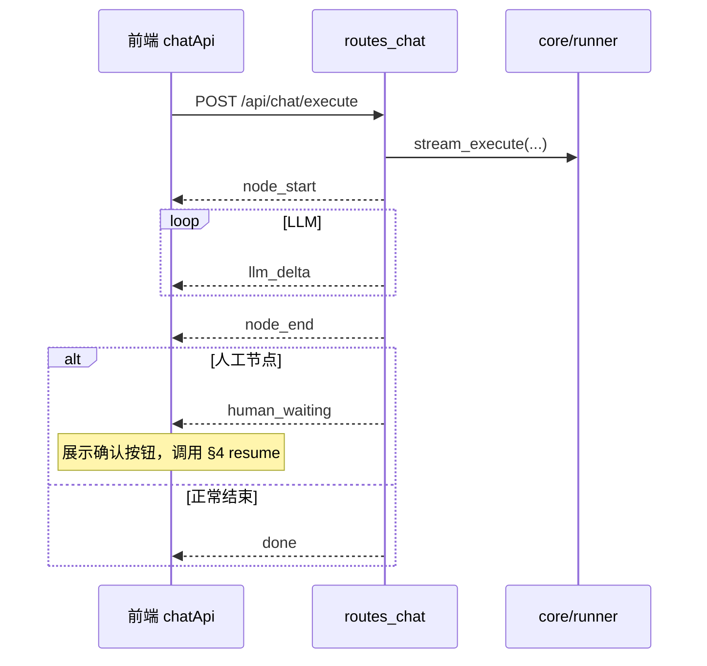

# PROTOCOL.md — API 契约与事件流定义

> **在编写实现代码之前，必须先阅读并遵守本文档。** 与 `AGENT.md`、`SKILL.md` 同级约束；**HTTP 路径、Body 字段、SSE `event` 名称以本文为准**。
>
> **这是一个 Demo，不是生产级项目。**

---

## 文档关系

| 文档 | 职责 |
|------|------|
| `AGENT.md` | MVP 边界、版本不可变、Checkpointer、决策流程 |
| `SKILL.md` | 目录、`NODE_TYPE_MAP`、`thread_id`、版本展示 |
| `PROTOCOL.md`（本文） | **API 路径、JSON / SSE 事件流** |
| `IMPLEMENTATION_PLAN.md` | State、DDL、类型定义；与本文冲突时**以本文为准** |

`frontend/src/mocks/`、`workflowApi.ts`、`chatApi.ts` 的结构**必须与本文一致**。

---

## 全局约定

### Base URL

| 环境 | URL |
|------|-----|
| 本地后端 | `http://localhost:5000` |
| 前端开发 | Vite 将 `/api` 代理至后端 |

### 请求头

| Header | 适用 | 值 |
|--------|------|-----|
| `Content-Type` | 所有 POST JSON | `application/json` |
| `Accept` | 对话 / Resume | `text/event-stream` |

### 非 SSE JSON 响应（统一包装）

除 SSE 流式成功路径外，所有 JSON 响应：

```json
{ "code": 0, "data": {}, "msg": "ok" }
```

| code | 含义 | HTTP Status |
|------|------|-------------|
| `0` | 成功 | 200 |
| `1001` | 参数错误 | 400 |
| `1002` | 资源不存在 | 404 |
| `1003` | 业务冲突（如图校验失败） | 409 |
| `5000` | 服务器错误 | 500 |

### SSE 通用帧格式

```
event: <事件名>
data: <单行 JSON>

```

- `data` 必须为**单行** JSON 字符串
- 流建立前失败（参数错误等）：返回 JSON 错误体，**不**开启 SSE
- 流式成功路径**禁止**用 `application/json` 整包返回 AI 内容

---

## 1. 工作流发布接口

### 概要

| 项 | 值 |
|----|-----|
| 方法 / URL | `POST /api/workflows/publish` |
| 响应 | JSON `{ code, data, msg }` |
| 用途 | 发布工作流；复制版本、写入 `graph_spec`；已发布旧版本只读（`AGENT.md`） |

### Request Body

```json
{
  "name": "智能客服助手",
  "description": "包含 RAG 和人工介入",
  "graph_spec": {
    "nodes": [
      {
        "id": "node_1",
        "type": "start",
        "position": { "x": 0, "y": 0 }
      },
      {
        "id": "node_2",
        "type": "llm",
        "position": { "x": 100, "y": 0 },
        "config": {
          "model": "gpt-4",
          "prompt": "你是客服助手"
        }
      },
      {
        "id": "node_3",
        "type": "human",
        "position": { "x": 200, "y": 0 },
        "config": {
          "question": "请确认是否执行?"
        }
      }
    ],
    "edges": [
      { "id": "e1", "source": "node_1", "target": "node_2" },
      { "id": "e2", "source": "node_2", "target": "node_3" }
    ]
  },
  "version_info": {
    "is_major": true,
    "base_version": "v1.0.0"
  }
}
```

### 字段说明

#### 根对象

| 字段 | 类型 | 必填 | 说明 |
|------|------|------|------|
| `name` | `string` | 是 | 应用名称 |
| `description` | `string` | 否 | 广场摘要 |
| `graph_spec` | `object` | 是 | 图蓝图 |
| `version_info` | `object` | 否 | 版本策略；缺省视为首版 `v1.0.0` |

#### `graph_spec.nodes[]`

| 字段 | 必填 | 说明 |
|------|------|------|
| `id` | 是 | 节点 ID |
| `type` | 是 | 与 `NODE_TYPE_MAP` 一致：`start`、`llm`、`human`、`router` 等 |
| `position` | 是 | `{ "x": number, "y": number }` |
| `config` | 否* | 节点配置；`start`/`end` 可省略；业务节点建议提供 |

\* `llm`、`human`、`rag` 等业务节点**应**包含 `config`。

#### `graph_spec.edges[]`

| 字段 | 必填 | 说明 |
|------|------|------|
| `id` | 是 | 连线 ID |
| `source` | 是 | 源节点 `id` |
| `target` | 是 | 目标节点 `id` |

#### `version_info`

| 字段 | 类型 | 说明 |
|------|------|------|
| `is_major` | `boolean` | `true`：主版本 +1（`v1.x` → `v2.0.0`）；`false`：补丁 +1（`v1.1` → `v1.2`） |
| `base_version` | `string` | 基于哪个版本迭代，如 `v1.0.0`；**空或未传**则初始化为 `v1.0.0` |

### Response（成功）

HTTP `200`：

```json
{
  "code": 0,
  "data": {
    "workflow_id": "wf_123",
    "version": "v2.0.0"
  },
  "msg": "发布成功"
}
```

### 与 Canvas 编辑态对齐

- React Flow 编辑态使用 `data.config`（`SKILL.md`）
- 发布前由 `workflowStore` / `workflowApi.ts` 将画布数据组装为本文 `graph_spec`（`config` 提至节点级）
- 后端入库可存为 `canvas_json`；对外列表展示 `current_version`

---

## 2. 应用广场 / 个人应用列表

### 2.1 应用广场

| 项 | 值 |
|----|-----|
| 方法 / URL | `GET /api/workflows/playground` |
| 响应 | JSON |
| 用途 | `pages/Playground/` 展示已发布应用卡片 |

### 2.2 个人应用

| 项 | 值 |
|----|-----|
| 方法 / URL | `GET /api/users/apps` |
| 响应 | JSON |
| 用途 | `pages/MyApps/` 展示已安装 / 使用中的应用 |

### Response（两接口结构一致）

HTTP `200`：

```json
{
  "code": 0,
  "data": [
    {
      "workflow_id": "wf_123",
      "name": "智能客服",
      "description": "包含 RAG 和人工介入",
      "current_version": "v2.0.0",
      "icon": "🤖",
      "updated_at": "2026-06-29"
    }
  ],
  "msg": "ok"
}
```

| 字段 | 说明 |
|------|------|
| `current_version` | **必须**在卡片 UI 显式展示，如 `v2.0.0`（`SKILL.md` §3.2） |
| `icon` | emoji 或 URL |
| `updated_at` | 日期或 ISO8601 字符串 |

`data` 为数组；无数据时 `[]`。

---

## 3. 执行对话（核心 SSE 流式接口）

### 概要

| 项 | 值 |
|----|-----|
| 方法 / URL | `POST /api/chat/execute` |
| 响应 | **`Content-Type: text/event-stream`** |
| 禁止 | JSON 整包返回对话内容 |

### Request Body

```json
{
  "workflow_id": "wf_123",
  "thread_id": "uuid-xxx-xxx",
  "input_text": "你好，我的订单丢了",
  "resume_data": null
}
```

| 字段 | 类型 | 必填 | 说明 |
|------|------|------|------|
| `workflow_id` | `string` | 是 | 要执行的工作流 ID |
| `thread_id` | `string` | 是 | **新建**：前端 `crypto.randomUUID()` 生成；**继续**：传历史 `thread_id` |
| `input_text` | `string` | 是 | 用户本轮输入 |
| `resume_data` | `object` / `null` | 否 | 普通对话传 `null`；若在 execute 内嵌恢复可传对象（**推荐人工恢复用 §4**） |

### Response 头

| Header | 值 |
|--------|-----|
| `Content-Type` | `text/event-stream` |
| `Cache-Control` | `no-cache` |
| `Connection` | `keep-alive` |
| `X-Accel-Buffering` | `no` |

### SSE 事件定义（前端必须按此解析）

| `event` | `data` 示例 | 触发时机 |
|---------|-------------|----------|
| `node_start` | `{"node_id":"llm_1","node_type":"llm"}` | 即将进入某节点执行 |
| `llm_delta` | `{"content":"你好","node_id":"llm_1"}` | LLM 流式增量 Token |
| `human_waiting` | `{"node_id":"human_1","question":"请确认是否退款?","checkpoint_ns":"xxx:xxx"}` | 人工介入；服务端挂起；前端展示确认 UI |
| `node_end` | `{"node_id":"llm_1","output":"..."}` | 单个节点执行完毕 |
| `done` | `{"final_output":"处理完毕","thread_id":"uuid"}` | 整图执行结束 |
| `error` | `{"msg":"执行失败原因"}` | 执行异常；收到后关闭流 |

#### `node_start`

```json
{ "node_id": "llm_1", "node_type": "llm" }
```

#### `llm_delta`

```json
{ "content": "你好", "node_id": "llm_1" }
```

- 前端累加 `content` 渲染流式文本

#### `human_waiting`

```json
{
  "node_id": "human_1",
  "question": "请确认是否退款?",
  "checkpoint_ns": "xxx:xxx"
}
```

- 保存 `checkpoint_ns` 与 `thread_id`，供 §4 Resume 使用
- 本轮 SSE 可在 `human_waiting` 后结束；后续走 `POST /api/chat/resume`

#### `node_end`

```json
{ "node_id": "llm_1", "output": "完整节点输出摘要" }
```

#### `done`

```json
{ "final_output": "处理完毕", "thread_id": "uuid-xxx-xxx" }
```

#### `error`

```json
{ "msg": "LangGraph 执行失败：模型超时" }
```

### SSE 流示例

```
event: node_start
data: {"node_id":"llm_1","node_type":"llm"}

event: llm_delta
data: {"content":"你好","node_id":"llm_1"}

event: llm_delta
data: {"content":"，请问有什么可以帮您？","node_id":"llm_1"}

event: node_end
data: {"node_id":"llm_1","output":"你好，请问有什么可以帮您？"}

event: done
data: {"final_output":"你好，请问有什么可以帮您？","thread_id":"uuid-xxx-xxx"}

```

### 推荐事件顺序



1. `node_start` → 若干 `llm_delta` → `node_end`（可重复多节点）
2. 人工：`human_waiting` → **结束本轮流** → 用户确认后 §4
3. 结束：`done`
4. 异常：`error`

### 实现落位

- 路由：`api/routes_chat.py`
- 门面：`core/runner.py`（禁止 `api/` 直连 LangGraph）
- 前端：`services/chatApi.ts` + `stores/chatStore.ts`

---

## 4. 恢复人工介入（Resume）

用户收到 `human_waiting` 并点击确认后调用。

### 概要

| 项 | 值 |
|----|-----|
| 方法 / URL | `POST /api/chat/resume` |
| 响应 | **SSE**（从 checkpoint 断点继续执行后续节点） |

### Request Body

```json
{
  "thread_id": "uuid-xxx-xxx",
  "checkpoint_ns": "xxx:xxx",
  "user_input": {
    "confirmed": true,
    "comment": "同意退款"
  }
}
```

| 字段 | 类型 | 必填 | 说明 |
|------|------|------|------|
| `thread_id` | `string` | 是 | 与 `human_waiting` / `done` 中一致 |
| `checkpoint_ns` | `string` | 是 | 从 `human_waiting` 事件的 `data` 获取 |
| `user_input` | `object` | 是 | 用户确认结果 |
| `user_input.confirmed` | `boolean` | 是 | 是否确认 |
| `user_input.comment` | `string` | 否 | 补充说明 |

### Response

与 §3 相同：`Content-Type: text/event-stream`，事件类型仍为 `node_start` / `llm_delta` / `human_waiting` / `node_end` / `done` / `error`。

从断点处继续，直至 `done` 或再次 `human_waiting`。

### 流程示意

```
execute → ... → human_waiting (保存 checkpoint_ns)
       → 用户点击确认
resume  → node_start → ... → done
```

---

## 5. 附录：草稿保存（Canvas 编辑，非发布）

编排页保存草稿、不发布时使用。路径与字段与发布不同，**不得**与 §1 混用。

| 项 | 值 |
|----|-----|
| 方法 / URL | `POST /api/workflows` |
| 用途 | 保存 `status=draft`；Body 含 `nodes`（`id, type, position, data.config`）与 `edges`（`id, source, target`） |

详见历史 `SKILL.md` §3.1；发布时转换为 §1 的 `graph_spec` 调用 `POST /api/workflows/publish`。

---

## API 清单摘要

| # | 方法 | 路径 | 响应 |
|---|------|------|------|
| 1 | POST | `/api/workflows/publish` | JSON |
| 2 | GET | `/api/workflows/playground` | JSON |
| 3 | GET | `/api/users/apps` | JSON |
| 4 | POST | `/api/chat/execute` | SSE |
| 5 | POST | `/api/chat/resume` | SSE |
| 6 | POST | `/api/workflows` | JSON（草稿，附录） |

---

## Mock 对齐

| Mock 文件 | 对齐章节 |
|-----------|----------|
| `mocks/workflows.ts` | §1 发布、§2 列表、§5 草稿 |
| `mocks/chatStream.ts` | §3、§4 SSE 事件序列 |
| `mocks/nodeTypes.ts` | `graph_spec.nodes[].type` |

---

## 版本记录

| 版本 | 日期 | 说明 |
|------|------|------|
| `2.0.0` | 2026-06-29 | 发布 `graph_spec` + `version_info`；广场/个人列表；execute/resume SSE 事件流 |
| `1.0.0` | 2026-06-29 | 初版（已废弃路径 `/api/chat/{id}` 等） |

---

## 实现前自检

- [ ] 发布走 `POST /api/workflows/publish`，含 `graph_spec` 与 `version_info`
- [ ] 广场 `GET /api/workflows/playground`；个人 `GET /api/users/apps`；卡片展示 `current_version`
- [ ] 对话走 `POST /api/chat/execute`；SSE 事件名：`node_start`、`llm_delta`、`human_waiting`、`node_end`、`done`
- [ ] 人工恢复走 `POST /api/chat/resume`，携带 `checkpoint_ns` + `user_input`
- [ ] 新建会话前端生成 `thread_id`；继续会话携带历史 `thread_id`
- [ ] 成功路径无 JSON 整包 AI 回复；逻辑在 `core/runner.py`
- [ ] Mock 与本文一致
